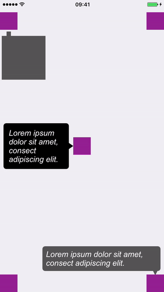

# TipView | Tool tip library
An auto layout engine driven ready to use tool tip library written in swift with full customization support.

[![Swift Version][swift-image]][swift-url]
[](http://cocoapods.org/pods/LFAlertController)
[](http://makeapullrequest.com)



## Features

- [x] Ready to use tip view
- [x] Orientation support provided by autolayout engine
- [x] Global styling configuration
- [x] Override specific instance styling configuration
- [x] Supports custom views
- [x] Animation on show/dismiss
- [x] Supports custom animation
- [x] Dismiss on tap
- [x] Dismiss on tap outside within the container
- [x] Dismiss after specified duration

## Requirements

- iOS 9.0+
- Xcode 9.0

## Installation

#### Manually
1. Download and drop ```TipViewSource``` in your project.
2. Congratulations!  

## Usage example

```swift
// Simply call show on TipView instance with basic parameters
TipView().show(message: <tip message>, 
                sourceView: <source view>, 
                containerView: <container view>, 
                direction: .right)

// Apply Global configurations using provided class properties.
// All the styling properties are available as instance property as well
// to support overriding global configuration on a specific instance

TipView.maxWidth = 270
TipView.color = UIColor.darkGray
TipView.font = UIFont(name: "Arial-ItalicMT", size: 18.0)
TipView.enableDismissOnTapOverTip = true
TipView.showAnimation = TipViewAnimation.showWithScale
TipView.dismissAnimation = TipViewAnimation.dismissWithScale
//TipView.enableDismissOnTapOutsideTipInContainer = true

// Custom message view and anchor view

let customTip = TipView()

let customMessageView = UIView(frame: CGRect.zero)
customMessageView.translatesAutoresizingMaskIntoConstraints = false
customMessageView.widthAnchor.constraint(equalToConstant: 100).isActive = true
customMessageView.heightAnchor.constraint(equalToConstant: 100).isActive = true
customMessageView.backgroundColor = UIColor.darkGray

// Don't set customAnchorView if you want to show the default
// anchorView.
customTip.customAnchorView = UIView(frame: CGRect.zero)
customTip.customAnchorView!.translatesAutoresizingMaskIntoConstraints = false
customTip.customAnchorView!.widthAnchor.constraint(equalToConstant: 10).isActive = true
customTip.customAnchorView!.heightAnchor.constraint(equalToConstant: 10).isActive = true
customTip.customAnchorView!.backgroundColor = UIColor.darkGray

customTip.show(messageView: customMessageView, 
    sourceView: self.leftTopView, 
    containerView: self.view, 
    direction: .bottom, 
    dismissClosure: { (tipView) in
        TipView().show(message: msg,
        sourceView: self.rightTopView,
        containerView: self.view,
        direction: .left)
    })

// Custom Animation

// Create your custom animation using TipView.AnimationClosureType type, example given below:
let showWithCustomAnimation: TipView.AnimationClosureType = { messageView, anchorView, completion in
            // Define animation as you would like
            messageView.transform = CGAffineTransform(scaleX: 0, y: 0)
            anchorView.isHidden = true
            UIView.animate(withDuration: 0.5, delay: 0.0,
                           usingSpringWithDamping: 0.5,
                           initialSpringVelocity: 0.5,
                           options: [.beginFromCurrentState], animations: {
                            messageView.transform = .identity
            }) { (_) in
                anchorView.isHidden = false
                completion()
            }
        }
        
// Apply the custom show (or dismiss) animation on global configuration:
TipView.showAnimation = showWithCustomAnimation

// Or on a TipView instance
<TipView Instance>.showAnimation = showWithCustomAnimation

```

## Contribute

We would love you for the contribution to **TipView**.

[swift-image]:https://img.shields.io/badge/swift-4.0-orange.svg
[swift-url]: https://swift.org/
[license-image]: https://img.shields.io/badge/License-MIT-blue.svg
[license-url]: LICENSE
[codebeat-image]: https://codebeat.co/badges/c19b47ea-2f9d-45df-8458-b2d952fe9dad
[codebeat-url]: https://codebeat.co/projects/github-com-vsouza-awesomeios-com
